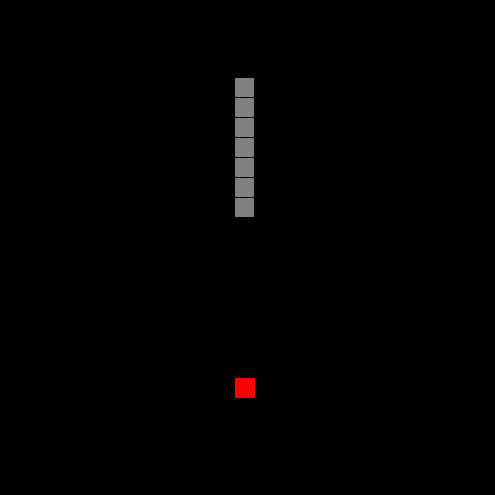

# Snake Game

## Demonstration

Clássico snake game. Para jogar [clica aqui](site).

 

## status
🚧 Em desenvolvimento 🚀

 

##  Features

- [ ] Tela de start
- [ ] Tela de game over
- [ ] Mudar o estilo da snake
- [ ] Mudar campo do jogo
- [ ] Configurar para mobile
- [ ] Criar novas fases com obstáculos

  

## 💻 Techs

* [ ] Html
* [ ] css
* [ ] Java Script

 

# Author

**Douglas D. Santos**

Encontre-me em [?&style=for-the-badge&logo=gmail&logoColor=white)](mailto:douglas.d.santos.dev@gmail.com) [.svg?&style=for-the-badge&logo=linkedin&logoColor=white)](https://www.linkedin.com/in/douglas-santos-8442b41ba/)

  

## 📕 Licença

 

Esse projeto está sob a licença MIT. Veja o arquivo [LICENSE](https://github.com/DouglasSantos-code/Site-Personal-Trainer/blob/main/LICENSE) para mais detalhes.